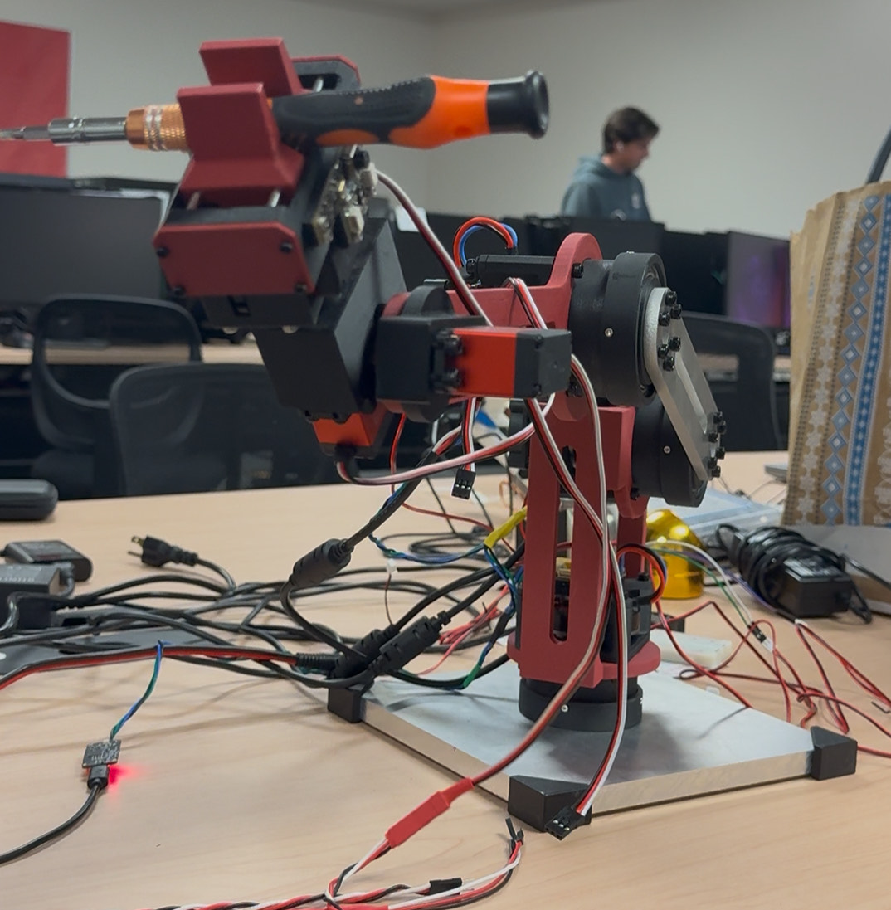

  <h1 style="margin:0 0 6px 0;font-size:38px;line-height:1.15;letter-spacing:.3px;">
    Vizzy: Enhancing Robotic Manipulation with Vision-Enabled Large Language Models
  </h1>

  

    University of Utah — Electrical & Computer Engineering Capstone
  

  

    Authors: Burke Dambly · Miles Bovero · Lawrence Ponce · Brian Stites · Jesse Jenkins
  

   
  <!-- tech badges -->
  

    
    
    
    
    
  

  

## Overview

<!-- Overview Section -->

  

    <strong>Vizzy</strong> is a modular 5-axis robotic arm designed to demonstrate the integration of 
    <strong>computer vision</strong>, <strong>inverse kinematics</strong>, and 
    <strong>large language model (LLM)</strong> reasoning for adaptive robotic control.  
    The project explores how artificial intelligence can make robotic systems more flexible and user-friendly 
    by combining visual perception and semantic reasoning into a single integrated robotic platform.
  

  

    Unlike traditional robotic systems that require explicit programming and rigid motion paths, Vizzy enables 
    high-level natural language interaction. Through vision-based object detection and LLM-driven task scheduling, 
    the system can autonomously interpret and execute user requests.
  

  

<em>Figure 1 — Conceptual overview of Vizzy’s modular arm system.</em>

## System Architecture

### Hardware

- **Motors:** MJBOTS mj5208 BLDC outrunner motors  
- **Motor Controllers:** Moteus r.11 (Field-Oriented Control)  
- **Microcontrollers:** Raspberry Pi 4B and Raspberry
- **Sensors:** 16MP USB camera (YOLO11 vision model) and VL53L1X time-of-flight sensor  
- **Communication:** CAN-FD network using the Moteus protocol  
- **Structure:** CNC-milled T2-grade aluminum and PETG-CF 3D-printed components  
- **Power Supply:** Mean Well 24V .625A DC Power Supply 

<!-- 3x2 image grid for README -->
<table align="center">
  <tr>
    <td align="center">
      
      
2-Stage Planetary GearBox

    </td>
    <td align="center">
      
      
End Effector

    </td>
    <td align="center">
      
      
Upper Arm Linkage

    </td>
  </tr>
  <tr>
    <td align="center">
      
      
System with Power Box

    </td>
    <td align="center">
      
      
Printed End Effector

    </td>
    <td align="center">
      
      
Arm Extended with Aluminum

    </td>
  </tr>
</table>

<em>Figure 2 — Hardware overview showing mechanical components.</em>

### Software

- **Vision Stack:** YOLO11 segmentation for object recognition and localization  
- **Semantic Layer:** LLM-based contextual enrichment of detected objects  
- **Control Framework:** Python API for inverse kinematics and motion planning  
- **GUI:** Tkinter-based interface for manual coordinate input and visualization  
- **Embedded Firmware:** FreeRTOS task scheduling for low-level actuation and safety  

  
*Figure 3 — Software architecture illustrating perception, reasoning, and control flow.*

---

## Key Features

- Five-axis robotic manipulation with inverse kinematics control  
- Real-time visual perception using YOLO11 segmentation  
- Natural-language task execution via OpenAI’s API  
- Modular structure with customizable end-effectors  
- Safety-limited motion and emergency fault handling  
- Open-source software stack for reproducibility and community use  

  
*Figure 4 — Visualization of major system capabilities.*

---
<h2 id="about-the-authors" align="center">About the Authors</h2>

<table style="width:100%;border-collapse:separate;border-spacing:18px 14px;">
  <tr align="center" valign="top">
    <td style="width:33%;border:1px solid #d0d7de;border-radius:10px;padding:16px;background:#fafbfc;">
      <strong>Burke Dambly</strong> 
      <em style="color:#57606a;">Computer Engineering</em> 
      Focused on control systems, embedded firmware, and integration of Moteus-controlled BLDC actuators with high-level Python logic.
    </td>
    <td style="width:33%;border:1px solid #d0d7de;border-radius:10px;padding:16px;background:#fafbfc;">
      <strong>Miles Bovero</strong> 
      <em style="color:#57606a;">Mechanical Engineering</em> 
      Blah blah YOLO
    </td>
    <td style="width:33%;border:1px solid #d0d7de;border-radius:10px;padding:16px;background:#fafbfc;">
      <strong>Lawrence Ponce</strong> 
      <em style="color:#57606a;">Computer Engineering</em> 
      LM blah blah
    </td>
    
  </tr>

  <tr align="center" valign="top">
    <td style="width:33%;border:1px solid #d0d7de;border-radius:10px;padding:16px;background:#fafbfc;">
      <strong>Brian Stites</strong> 
      <em style="color:#57606a;">Electrical Engineering</em> 
      Designed and assembled the power distribution and safety systems for the robotic arm.
    </td>
    <td style="width:33%;border:1px solid #d0d7de;border-radius:10px;padding:16px;background:#fafbfc;">
      <strong>Jesse Jenkins</strong> 
      <em style="color:#57606a;">Computer Science</em> 
      Contributed to the inverse kinematics (IK) framework for precise arm positioning and control.
    </td>
    <td style="width:33%;border:1px dashed #d0d7de;border-radius:10px;padding:16px;background:#fafbfc;">
      <strong>Neal Patwari</strong> 
      <em style="color:#57606a;">Faculty Advisor</em> 
      Provided guidance on system integration and research methodology throughout the Vizzy capstone project.
    </td>
  </tr>
</table>

## Acknowledgements

This project was developed as part of the University of Utah Electrical and Computer Engineering Capstone Program.  
Special thanks to the faculty mentors and the Utah Machine Shop for technical support and machining resources.

